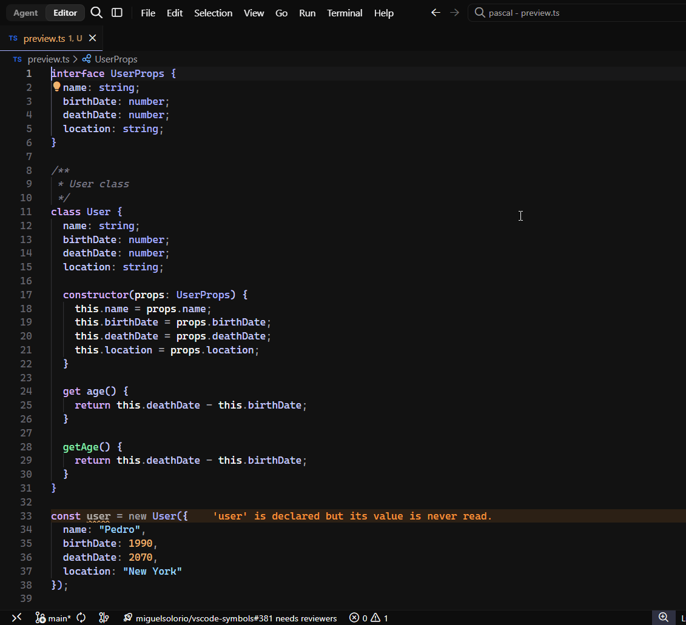

<div align="center">
  
  <h1>Pascal</h1>
  <p>
    A modern dark theme for your favorite editors, shells and more
    <br/>
    by <a href="https://github.com/hadez8877">@Hadez</a>
  </p>

  <p align="center">
    
    
    
  </p>
</div>

## Overview

Pascal is a modern dark theme crafted for developers who spend long hours in front of a screen. With carefully selected contrast levels and a harmonious color palette, it reduces eye strain while keeping your code readable and vibrant.

## Preview



## Installation

#### Install using Command Palette

1.  Go to `View -> Command Palette` or press `Ctrl+Shift+P`
2.  Then enter `Install Extension`
3.  Write `Pascal`
4.  Select it or press Enter to install

#### Install using Git

If you are a git user, you can install the theme and keep up to date by cloning the repo:

```shell
git clone https://github.com/hadez8877/pascal.git ~/.<your-editor>/extensions/pascal
cd ~/.<your-editor>/extensions/pascal

# Install dependencies
pnpm install

# Build the theme
pnpm run build
```

#### Activating theme

Run your editor. The Pascal theme will be available from `File -> Preferences -> Color Theme` dropdown menu.
