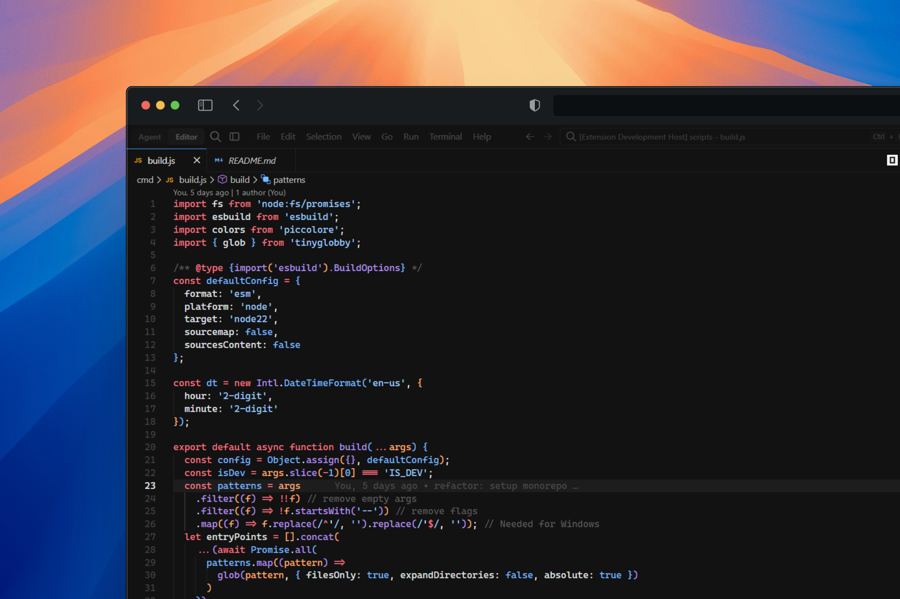

  
  <h1>Pascal</h1>
  

    A modern dark theme for your favorite editors, shells and more
     
    by <a href="https://github.com/hadez8877">@Hadez</a>
  

  

    
    
    
  

## What is Pascal?

Pascal is a dark theme designed for long coding sessions. The color palette is carefully tuned to provide enough contrast to read code clearly without causing eye strain over extended periods.

  
Click to view the previews

  

### Features

- **Carefully crafted color palette** — Optimized for readability and reduced eye fatigue
- **Multi-editor support** — Works with VS Code and more editors planned
- **Consistent styling** — Unified look across different file types and languages
- **Easy to install** — Available on Open-VSX marketplace

## Installation

### Visual Studio Code

#### From Marketplace (Recommended)

Install the extension from [Open-VSX](https://open-vsx.org/extension/hadez8877/pascal-vscode):

1. Open VS Code
2. Press `Ctrl+Shift+X` to open the Extensions view
3. Search for "Pascal"
4. Click **Install**

#### Manual Installation

1. Download the `.vsix` file from [the latest GitHub release][github-release-page]
2. Open VS Code
3. Press `Ctrl+Shift+P` and select "Extensions: Install from VSIX..."
4. Select the downloaded file

## Community

The Pascal community can be found on [GitHub Discussions][github-discussions-page], where you can ask questions, RFC ideas, and get support.

Our [Code of Conduct](./CODE_OF_CONDUCT.md) applies to all Pascal community channels.

## Contributing

New contributors welcome! Check out our [Contributing Manual](./CONTRIBUTING.md) for help getting started.

## Links

- [Contributing Manual](./CONTRIBUTING.md)
- [License](./LICENSE)

[github-release-page]: https://github.com/hadez8877/pascal/releases/latest
[github-discussions-page]: https://github.com/hadez8877/pascal/discussions
