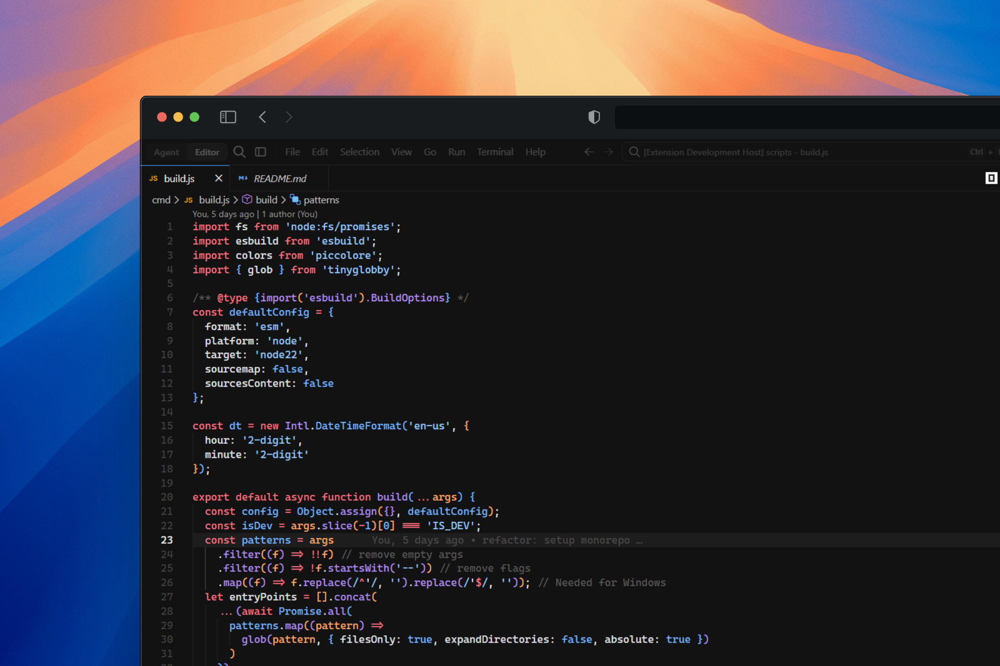

# Pascal for [VSCode](https://code.visualstudio.com)

Pascal is a dark theme for editors, shells, and more. The palette is tuned for long coding sessions: enough contrast to read code clearly, not so intense that your eyes notice it after an hour.

## Preview

## Installation

### Preferred method of installation

Install the extension from a Marketplace:

- [Open-VSX](https://open-vsx.org/extension/hadez8877/pascal-vscode)

### Manual method for installation

Download the VSIX from
[the latest GitHub release](https://github.com/hadez8877/pascal/releases/latest).
Open the Command Palette and select "Extensions: Install from VSIX...", then open the file you just downloaded.
